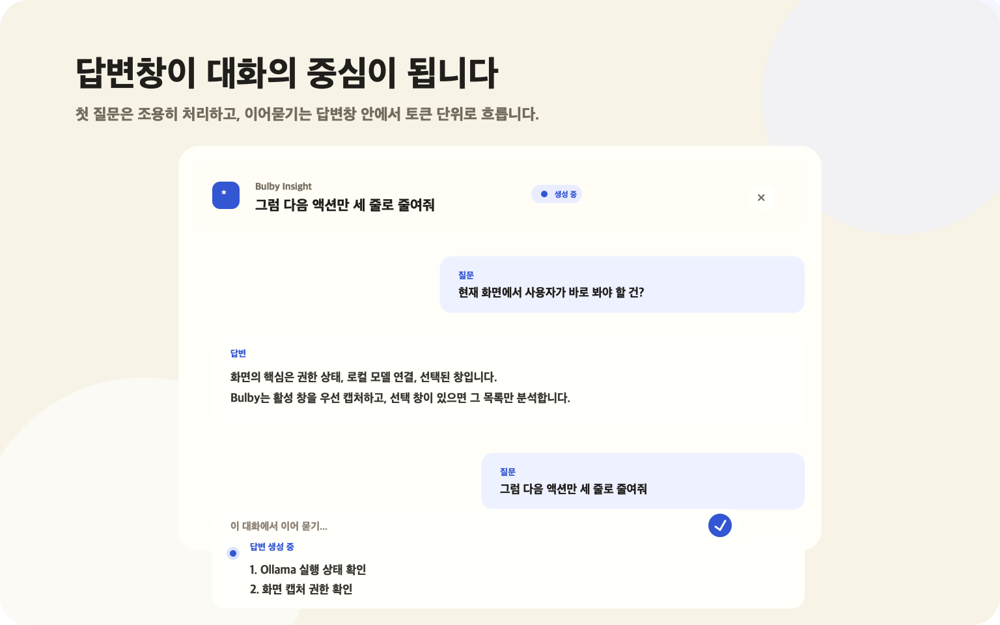
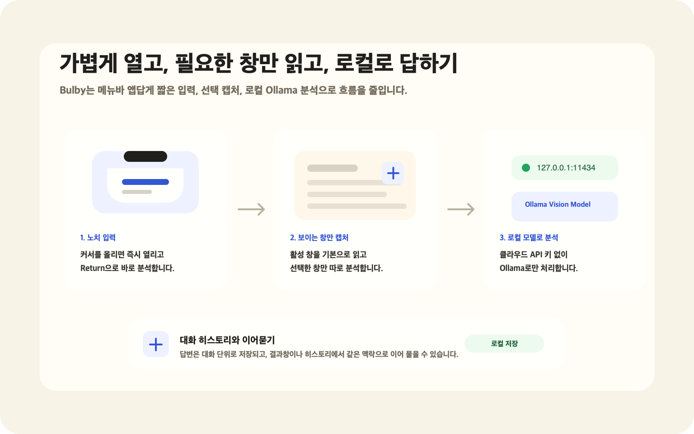

# Bulby

Bulby는 맥북 노치 영역을 빠른 입력창처럼 사용하는 로컬 화면 AI 비서입니다.
현재 보고 있는 창을 캡처해 로컬 Ollama 모델로 분석하고, 답변은 전용 패널에서 대화처럼 이어갈 수 있습니다.

## 핵심 기능

- 노치 근처에 커서를 올리면 바로 열리는 가벼운 입력창
- 활성 창 자동 캡처와 선택 창 다중 캡처
- Ollama 기반 로컬 비전 모델 처리
- 답변창 안에서 이어 묻는 대화형 흐름
- 토큰 단위로 표시되는 이어묻기 스트리밍 답변
- 질문/답변 히스토리 저장
- 번역, 설명, 리뷰 같은 커스텀 모드
- 클라우드 API 키 없이 동작하는 로컬 우선 구조

## 화면

| 이어지는 답변창 | 로컬 처리 흐름 |
| --- | --- |
|  |  |

## 준비하기

- macOS 14.0 이상
- [Ollama](https://ollama.com/) 설치 및 실행
- 비전 입력을 지원하는 Ollama 모델
- Bulby에 대한 화면 캡처 권한

기본 모델 이름은 `gemma4:e4b`로 설정되어 있습니다. 설치된 모델이 다르면 앱 메뉴에서 다른 모델을 선택하면 됩니다.

## 설치하기

1. [Releases](https://github.com/leeshinhyuk/bulby/releases)에서 최신 DMG 파일을 받습니다.
2. DMG를 열고 `Bulby.app`을 Applications 폴더로 옮깁니다.
3. Ollama를 실행한 뒤 Bulby를 엽니다.
4. 처음 실행할 때 macOS가 요청하면 화면 캡처 권한을 허용합니다.

## 사용 방법

- 노치 영역에 커서를 올려 입력창을 엽니다.
- 질문을 입력하고 Return을 누르면 현재 화면을 캡처해 분석합니다.
- 메뉴바 전구를 좌클릭하면 최근 답변창을 엽니다.
- 메뉴바 전구를 우클릭하면 모델, 히스토리, 선택 창, 권한 상태를 확인할 수 있습니다.
- 답변창 하단 입력창에서 같은 대화를 이어서 질문할 수 있습니다.
- 창 선택 버튼으로 분석할 창을 직접 지정할 수 있습니다.

## 개인정보

Bulby는 로컬 우선으로 설계되어 있습니다. 캡처된 화면 이미지는 앱이 직접 클라우드 API로 보내지 않고, 로컬 Ollama 서버인 `127.0.0.1:11434`로만 전달합니다.

앱은 커스텀 모드, 선택된 모델, 질문/답변/캡처한 창 제목이 포함된 최근 대화 히스토리를 로컬 `UserDefaults`에 저장합니다. 원본 스크린샷 파일은 저장하지 않습니다.

자세한 내용은 [PRIVACY.md](PRIVACY.md)를 참고하세요.

## 문제 해결

- 답변이 생성되지 않으면 Ollama가 실행 중인지 확인하세요.
- 모델 목록이 비어 있으면 Ollama에 비전 모델을 설치하세요.
- 화면 캡처가 실패하면 시스템 설정에서 Bulby의 화면 기록 권한을 다시 확인하세요.
- 권한을 방금 바꿨다면 앱을 완전히 종료한 뒤 다시 실행하세요.
- 엉뚱한 창이 캡처되면 메뉴에서 선택 창을 초기화한 뒤 다시 시도하세요.
